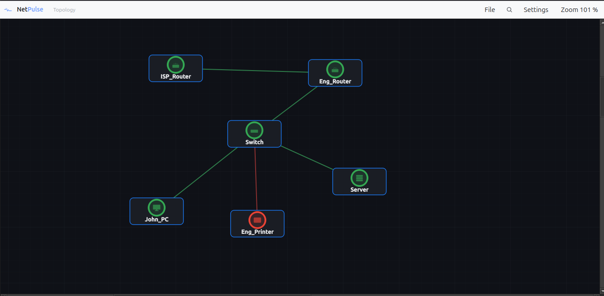

# NetPulse - Network Monitoring System

> Monitor your network and get instant email alerts when devices go down and recover.

[](LICENSE)
[](https://python.org)
[](https://fastapi.tiangolo.com)

## What it does

NetPulse pings devices over ICMP, tracks their up/down state, sends
email alerts on down, recovery, and flapping events, and stores
everything in SQLite.

You get three ways to use it:

- **Desktop GUI** — build a network topology by dragging device nodes
  onto a canvas, connect them, and watch live status update in place.
  Per-topology save/open. This is the newest front end and the one
  most worth a look.
- **Web dashboard** — a FastAPI + Jinja view of the same data, intended
  for multi-user access.
- **CLI** — monitor a fleet from the terminal.

All three share the same core: the `Device` state machine, the
`MonitoringEngine`, the `AlertServiceV2`, and the SQLite schema.

---

## Desktop GUI

The desktop app is a PySide6 application that reuses NetPulse's
monitoring core.

**Features**

- Drag-and-drop device nodes: Router, Switch, Server, PC, Generic
- Connections between nodes; edges follow nodes as they're dragged
- Live ICMP status: colour ring per node reflects UP / DEGRADED /
  DOWN / UNKNOWN, and link quality severity
- Per-topology SQLite files — save and open multiple topologies
  (office, datacentre, lab)
- Zoom, pan, find-by-name, fit-to-window
- Email alerts via the shared `AlertServiceV2`

**Install (Linux, no sudo)**

    git clone https://github.com/Kmmadu/NetPulse.git
    cd NetPulse
    bash network-monitor/desktop/install.sh

This installs under `~/.local/`, adds a NetPulse entry to your
applications menu, and provides a `netpulse` command.

**Run**

    netpulse

Or launch "NetPulse" from your applications menu.

**Uninstall**

    bash network-monitor/desktop/install.sh --uninstall

---

## Web dashboard

A FastAPI backend and a small Jinja-rendered frontend for viewing
device status in a browser. Intended for shared use.

<!-- SCREENSHOT: web dashboard. If you want to keep the existing
     dashboard.png, save it to network-monitor/web/docs/screenshot.png
     and reference it here. Otherwise remove this block. -->

---

## CLI

Run monitoring and device management from the terminal. See
`network-monitor/cli/`.

---

## Repo layout

    NetPulse/
    └── network-monitor/
        ├── app/          Core: Device model, MonitoringEngine,
        │                 AlertServiceV2, Database
        ├── cli/          Command-line interface
        ├── web/          FastAPI dashboard
        ├── desktop/      PySide6 desktop GUI (see above)
        └── requirements.txt

---

## How the desktop app is built

- **Canvas** — `desktop/ui/canvas.py` is a `QGraphicsView` with
  draggable `DeviceNode` items and `ConnectionItem` edges. Edges
  are clipped to the gap between node rects and do not intercept
  mouse events, so connected nodes stay draggable.
- **Worker** — `desktop/monitoring_worker.py` runs
  `MonitoringEngine` on a `QThread`. Per-cycle results are
  delivered as a queued Qt signal; the GUI thread never touches
  worker state.
- **Persistence** — every add, edit, move, and connection writes
  through to a per-topology SQLite file. Position changes are
  debounced so a drag writes once, not once per pixel.
- **File switching** — opening a different topology restarts the
  worker (the engine holds a `Database` for its lifetime) and
  reloads the canvas.

---

## Configuration

SMTP credentials and alert cooldowns are set in `.env`. For the
desktop app, use **Settings → SMTP Configuration** in the app.
For the web and CLI, copy `.env.example` to `.env` and edit.

```env
SMTP_SERVER=smtp.gmail.com
SMTP_PORT=587
SMTP_USERNAME=your-email@gmail.com
SMTP_PASSWORD=your-app-password
SMTP_FROM=your-email@gmail.com
SMTP_TO=alerts@yourdomain.com

ALERTS_ENABLED=true
ALERT_DOWN_COOLDOWN=5
ALERT_RECOVERY_COOLDOWN=5
ALERT_ERRATIC_COOLDOWN=30
```

---

## Gmail Setup (App Password)

1. Enable 2-Factor Authentication
2. Visit: https://myaccount.google.com/apppasswords
3. Generate an App Password
4. Use it as SMTP_PASSWORD

---

## Demo Video 


---

### Tests

```
cd network-monitor/desktop
python3 test_drop0a.py

```

---

### Use cases


---

### Roadmap

* Availability reports
* Historical graphs
* Slack / Teams notifications
* SMS alerts
* SNMP monitoring

### Use Cases

* ISP and small-datacentre device monitoring
* Internal infrastructure uptime tracking
* A lightweight alternative to heavier NMS tools

---

## License

MIT License

---

##  Author

Built by Mmadubugwu Kingsley Obinna — Network Engineer & Builder

---

## Support
* Issues: GitHub Issues
* Discussions: GitHub Discussions
